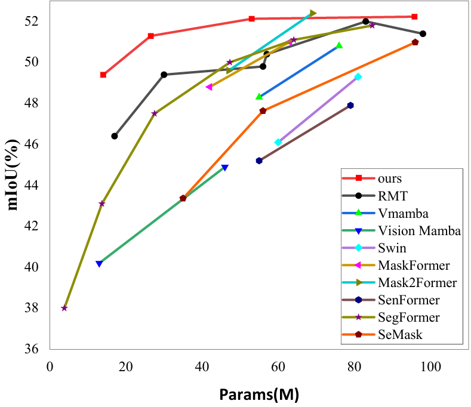

[](https://github.com/NVlabs/SegFormer/blob/master/LICENSE)


# SegRet: An Efficient Design for Semantic Segmentation with Retentive Network

<!--  -->
<div align="center">
  
</div>
<p align="center">
  Figure 1: Model comparison on ADE20K.
</p>

### [Project page](https://github.com/ZhiyuanLi218/segret) | [Paper](https://arxiv.org/abs/2502.14014) 

SegRet: An Efficient Design for Semantic Segmentation with Retentive Network.<br>

This repository contains the official Pytorch implementation of training & evaluation code and the pretrained models for [SegRet](https://arxiv.org/abs/2502.14014).


We use [MMSegmentation v0.13.0](https://github.com/open-mmlab/mmsegmentation/tree/v0.13.0) as the codebase.

SegRet is mainly built on [SegFormer](https://github.com/NVlabs/SegFormer) and [RMT](https://github.com/qhfan/RMT).


## Installation

For install and data preparation, please refer to the guidelines in [MMSegmentation v0.13.0](https://github.com/open-mmlab/mmsegmentation/tree/v0.13.0).

Other requirements:
```pip install timm==0.3.2```

An example (works for me): ```CUDA 11.7``` and  ```pytorch 1.12.1``` 

```
pip install -r requirements.txt
```

## Evaluation

Download `Weights`. 
(
[google drive](https://drive.google.com/drive/folders/1vreFkrWShrm6dWrymJDTVHacXVK0wY97?usp=sharing)
)

Example: evaluate ```SegRet-T``` on ```ADE20K```:

```
# Single-gpu testing
python tools/test.py local_configs/SegRet/T/SegRet.T.512x512.ade.160k_res.py /path/to/checkpoint_file

# Multi-gpu testing
./tools/dist_test.sh local_configs/SegRet/T/SegRet.T.512x512.ade.160k_res.py /path/to/checkpoint_file <GPU_NUM>

# Multi-gpu, multi-scale testing
tools/dist_test.sh local_configs/SegRet/T/SegRet.T.512x512.ade.160k_res.py /path/to/checkpoint_file <GPU_NUM> --aug-test

# Slurm testing
sbatch tools/slurm_test.sh
```

## Training

Download `RMT pretrained weights` 
(
[google drive](https://drive.google.com/drive/folders/1mjJa-8sbdIHtTvfFNscCwaS9VFUFyuvN?usp=sharing)
) 
pretrained on ImageNet-1K, and put them in a folder ```pretrained/```.


Example: train ```SegRet-T``` on ```ADE20K```:

```
# Single-gpu training
python tools/train.py local_configs/SegRet/T/SegRet.T.512x512.ade.160k_res.py 

# Multi-gpu training
./tools/dist_train.sh local_configs/SegRet/T/SegRet.T.512x512.ade.160k_res.py <GPU_NUM>

# Slurm training
sbatch tools/slurm_train.sh
```

## Visualize

Here is a demo script to test a single image. More details refer to [MMSegmentation's Doc](https://mmsegmentation.readthedocs.io/en/latest/get_started.html).

```shell
python demo/image_demo.py ${IMAGE_FILE} ${CONFIG_FILE} ${CHECKPOINT_FILE} [--device ${DEVICE_NAME}] [--palette-thr ${PALETTE}]
```

Example: visualize ```SegRet-T``` on ```CityScapes```: 

```shell
python demo/image_demo.py demo/demo.png local_configs/SegRet/T/SegRet.T.512x1024.city.160k.py \
/path/to/checkpoint_file --device cuda:0 --palette cityscapes
```


## Citation
```
@article{li2025segret,
      title={SegRet: An Efficient Design for Semantic Segmentation with Retentive Network}, 
      author={Zhiyuan Li and Yi Chang and Yuan Wu},
      journal={arXiv preprint arXiv:2412.14847},
      year={2025},
}

```
